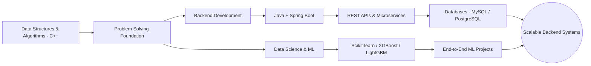

<div align="center">


<a href="https://github.com/aryanmishra1182-byte">
  
</a>

<br>


</div>

<br>

<p align="center">
  <a href="https://github.com/aryanmishra1182-byte"></a>
  <a href="https://leetcode.com/u/Aryannn1/"></a>
  <a href="https://www.codechef.com/users/crowd_grape_01"></a>
  <a href="https://www.hackerrank.com/aryanmishra1182"></a>
  <a href="mailto:aryanmishra1182@gmail.com"></a>
</p>

---

## 🧭 About Me

```yaml
name: Aryan Mishra
role: Aspiring Software Development Engineer / Backend Developer
education: B.Tech, Computer Science & Engineering (Data Science)
semester: 5th
core_interests:
  - Backend Development & Scalable Systems
  - Java & Spring Boot Ecosystem
  - Data Structures & Algorithms
  - Data Science & Machine Learning
philosophy: "Build, break, debug, and build again."
```

I'm a Computer Science undergraduate specializing in **Data Science**, currently steering my career toward **Backend Software Engineering**. I'm building a strong foundation in **Java, Spring Boot, and REST APIs**, while sharpening my problem-solving skills through consistent **DSA practice in C++**. Alongside this, I carry hands-on experience in **Data Science and Machine Learning**, giving me a well-rounded, analytical approach to building software.

---

## 🎯 Current Focus

<table>
<tr>
<td width="50%" valign="top">

### 🔨 Building
Backend services & REST APIs using **Spring Boot**

### 🌱 Learning
Advanced Java, Spring Boot internals, Databases & **System Design fundamentals**

</td>
<td width="50%" valign="top">

### 💻 Practicing
Data Structures & Algorithms in **C++** (140+ LeetCode problems solved)

### 🤝 Open To
**Internships**, collaborative projects, and backend engineering opportunities

</td>
</tr>
</table>

---

## 🛠️ Tech Stack

<div align="center">

**Languages**
<br>


**Backend Development**
<br>


**Databases**
<br>


**Data Science & Machine Learning**
<br>


**Developer Tools**
<br>


</div>

---

## 🧱 How My Skills Connect



---

## 🚀 Featured Projects

<table>
<tr>
<td width="50%">

### 🗂️ [Student Hub](https://github.com/aryanmishra1182-byte/Student-Hub)
A student productivity platform to manage timetables, notes, and tasks in one place.

**Stack:** `HTML` `CSS` `JavaScript`

</td>
<td width="50%">

### 🎯 [AI Candidate Ranking](https://github.com/aryanmishra1182-byte/redrob-ai-candidate-ranking)
AI-powered candidate discovery and ranking system using semantic retrieval and hybrid scoring.

**Stack:** `Python`

</td>
</tr>
<tr>
<td width="50%">

### 📈 [Student Performance Prediction](https://github.com/aryanmishra1182-byte/AryanMishra_PBEL_3.0)
End-to-end ML project predicting student exam performance from academic, lifestyle, and demographic features.

**Stack:** `Python` `Pandas` `NumPy` `Scikit-learn` `XGBoost` `Flask`

</td>
<td width="50%">

### 🎙️ [Voice AI Detector](https://github.com/aryanmishra1182-byte/voice-ai-detector)
A machine learning system to detect AI-generated voice/audio, served through a web application.

**Stack:** `Python` `Flask` `Machine Learning`

</td>
</tr>
<tr>
<td width="50%">

### 🤖 [Autonomous AI Persona](https://github.com/aryanmishra1182-byte/autonomous-ai-persona)
A Java-based project exploring autonomous AI persona/agent behavior.

**Stack:** `Java`

</td>
<td width="50%" valign="middle" align="center">

💡 *More backend & Spring Boot projects in progress — check my [repositories](https://github.com/aryanmishra1182-byte?tab=repositories) for the latest.*

</td>
</tr>
</table>

---

## 🏆 Coding Profiles

<p align="center">
  
</p>

<div align="center">

| Platform | Profile |
|---|---|
| 💻 GitHub | [@aryanmishra1182-byte](https://github.com/aryanmishra1182-byte) |
| 🟠 LeetCode | [Aryannn1](https://leetcode.com/u/Aryannn1/) |
| 🍫 CodeChef | [crowd_grape_01](https://www.codechef.com/users/crowd_grape_01) |
| 🟢 HackerRank | [aryanmishra1182](https://www.hackerrank.com/aryanmishra1182) |

</div>

---

## 📊 GitHub Statistics

<div align="center">


<br>


<br><br>


</div>

> *Stats are rendered by third-party services and may take a few seconds to load — the rest of the profile displays correctly even if one is temporarily unavailable.*

---

## 💭 Philosophy

> "The best way to learn software engineering is to build, break, debug, and build again."

---

## 📫 Connect With Me

<p align="center">
  <a href="https://github.com/aryanmishra1182-byte"></a>
  <a href="https://leetcode.com/u/Aryannn1/"></a>
  <a href="https://www.codechef.com/users/crowd_grape_01"></a>
  <a href="https://www.hackerrank.com/aryanmishra1182"></a>
  <a href="mailto:aryanmishra1182@gmail.com"></a>
</p>


<p align="center"><i>Thanks for stopping by — always open to feedback, collaboration, and new opportunities! 🚀</i></p>
