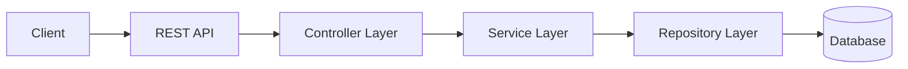
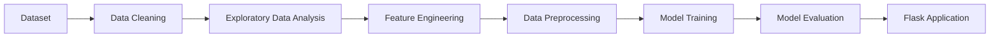

<!-- ============================================================ -->

<!--                     ARYAN MISHRA                            -->

<!--              JAVA | BACKEND | SPRING BOOT                   -->

<!-- ============================================================ -->

<div align="center">

# Hi 👋, I'm Aryan Mishra

### ☕ Aspiring Software Development Engineer | Java & Spring Boot | Backend Development | DSA

<br>

<!-- Animated typing effect -->


<br>
<br>

<a href="https://github.com/aryanmishra1182-byte">

</a>

<a href="https://leetcode.com/u/Aryannn1/">

</a>

<a href="https://www.hackerrank.com/aryanmishra1182">

</a>

</div>

---

<div align="center">

## 👨‍💻 About Me

</div>

```text
╔══════════════════════════════════════════════════════════════╗
║                                                              ║
║   👋 Hey! I'm Aryan Mishra                                   ║
║                                                              ║
║   🎓 B.Tech CSE Student specializing in Data Science         ║
║   ☕ Currently focused on Java & Backend Development         ║
║   🌱 Learning Spring Boot and backend architecture           ║
║   🧠 Practicing Data Structures & Algorithms using C++       ║
║   🗄️ Exploring databases and scalable backend systems       ║
║   📊 Background in Data Science & Machine Learning           ║
║   🚀 Working towards becoming a Software Development         ║
║      Engineer                                                ║
║                                                              ║
╚══════════════════════════════════════════════════════════════╝
```

I am a Computer Science student who enjoys understanding how software works behind the scenes.

My current primary focus is **Backend Development using Java and Spring Boot**.

I am actively working on strengthening my understanding of:

* Java fundamentals
* Object-Oriented Programming
* Collections Framework
* Exception Handling
* REST APIs
* Spring Boot
* JPA and Hibernate
* SQL
* MySQL
* PostgreSQL
* Backend architecture
* Authentication concepts
* Data Structures and Algorithms
* Software Engineering fundamentals

My background in **Data Science and Machine Learning** has helped me develop an analytical approach to solving problems, but my current career direction is focused primarily on becoming a strong **Backend / Software Development Engineer**.

---

<div align="center">

# ⚡ Current Focus

</div>

```text
┌─────────────────────────────────────────────────────────────┐
│                                                             │
│  🔭 CURRENTLY BUILDING                                      │
│     Backend applications and Java projects                  │
│                                                             │
│  🌱 CURRENTLY LEARNING                                      │
│     Java • Spring Boot • REST APIs • JPA • Hibernate        │
│                                                             │
│  🗄️ EXPLORING                                               │
│     MySQL • PostgreSQL • Database Design                    │
│                                                             │
│  🧠 PRACTICING                                              │
│     Data Structures & Algorithms using C++                  │
│                                                             │
│  🏗️ NEXT GOAL                                               │
│     Build scalable and production-oriented backend systems  │
│                                                             │
│  🚀 LONG-TERM GOAL                                          │
│     Become a strong Software Development Engineer           │
│                                                             │
└─────────────────────────────────────────────────────────────┘
```

---

# 🧑‍💻 Developer Profile

```java
public class AryanMishra {

    private String role =
            "Aspiring Software Development Engineer";

    private String primaryFocus =
            "Java Backend Development";

    private String framework =
            "Spring Boot";

    private String dsaLanguage =
            "C++";

    private String databases =
            "MySQL & PostgreSQL";

    private String mindset =
            "Learn → Build → Debug → Improve";

    public void currentJourney() {

        learnJava();

        buildBackendProjects();

        practiceDSA();

        understandDatabases();

        improveEveryDay();
    }
}
```

---

<div align="center">

# ☕ Java & Backend Development

</div>

Java is currently my primary language for backend development.

I am focused on building a strong foundation instead of simply jumping between frameworks.

My learning path currently includes:

```text
Java Fundamentals
       │
       ▼
Object-Oriented Programming
       │
       ▼
Collections Framework
       │
       ▼
Exception Handling
       │
       ▼
File Handling
       │
       ▼
Multithreading Concepts
       │
       ▼
SQL & Databases
       │
       ▼
JDBC
       │
       ▼
Spring Framework
       │
       ▼
Spring Boot
       │
       ▼
REST APIs
       │
       ▼
JPA & Hibernate
       │
       ▼
Authentication & Security
       │
       ▼
System Design Fundamentals
       │
       ▼
Scalable Backend Systems
```

---

# 🛠️ Tech Stack

<div align="center">

### Programming Languages


<br>
<br>

### Backend Development


<br>
<br>

### Databases


<br>
<br>

### Developer Tools


<br>
<br>

### Data Science Background


</div>

---

# ⚙️ Backend Development Stack

<div align="center">


</div>

<br>

### Technologies I'm focusing on

```text
☕ Java
│
├── Core Java
├── OOP
├── Collections Framework
├── Exception Handling
├── File Handling
├── Multithreading Concepts
└── JDBC
```

```text
🌱 Spring Boot
│
├── Spring Core Concepts
├── Dependency Injection
├── REST Controllers
├── Request & Response Handling
├── Service Layer
├── Repository Layer
├── JPA
└── Hibernate
```

```text
🗄️ Databases
│
├── SQL
├── MySQL
├── PostgreSQL
├── CRUD Operations
├── Joins
├── Relationships
└── Database Integration
```

---

# 🏗️ Backend Architecture

A typical backend architecture I am learning to build:



---

# 🔄 Request Flow

```text
CLIENT REQUEST
      │
      ▼
┌─────────────────────┐
│   REST CONTROLLER   │
└─────────────────────┘
      │
      ▼
┌─────────────────────┐
│   SERVICE LAYER     │
│   Business Logic    │
└─────────────────────┘
      │
      ▼
┌─────────────────────┐
│   REPOSITORY LAYER  │
│   Database Access   │
└─────────────────────┘
      │
      ▼
┌─────────────────────┐
│      DATABASE       │
└─────────────────────┘
      │
      ▼
    RESPONSE
```

---

<div align="center">

# 🧠 Data Structures & Algorithms

</div>

I practice Data Structures and Algorithms primarily using **C++**.

Currently, I have solved **140+ problems on LeetCode** and continue improving my problem-solving skills.

My focus is not only solving problems but understanding:

* Why an approach works
* Time complexity
* Space complexity
* Edge cases
* Different approaches to the same problem
* How to optimize brute-force solutions

---

# 🗺️ DSA Learning Journey

```text
FOUNDATIONS
│
├── Arrays
│
├── Strings
│
├── Sorting
│
├── Searching
│
└── Basic Mathematics
```

```text
DATA STRUCTURES
│
├── Linked Lists
│
├── Stacks
│
├── Queues
│
├── Hashing
│
└── Recursion
```

```text
TREES & GRAPHS
│
├── Binary Trees
│
├── Binary Search Trees
│
├── Tree Traversals
│
├── Graph Traversals
│
└── Shortest Path Concepts
```

```text
ADVANCED TOPICS
│
├── Backtracking
│
├── Greedy Algorithms
│
├── Dynamic Programming
│
├── Graph Algorithms
│
└── Advanced Problem Solving
```

> 🚧 This is an ongoing learning journey. The goal is consistent improvement, not claiming mastery.

---

# 📂 Featured Projects

---

## 🎓 Student Hub

### A student productivity application

Student Hub is designed to help students organize important academic activities in one place.

### Features

```text
📅 Timetable Management

📝 Notes Management

✅ Task Management

🎓 Student Productivity
```

### Tech Stack

```text
HTML

CSS

JavaScript
```

### Project Structure

```text
Student Hub
│
├── User Interface
│
├── Timetable Management
│
├── Notes
│
└── Tasks
```

### Repository

**Student Hub →** [View Repository](https://github.com/aryanmishra1182-byte/Student-Hub)

---

## 📊 AI-Driven Student Performance Prediction

An end-to-end Machine Learning project focused on predicting student performance using academic, behavioral, and lifestyle-related factors.

The project involves a complete workflow from data processing to model deployment.

### Technologies Used

```text
Python

Pandas

NumPy

Scikit-learn

XGBoost

Flask

Joblib

HTML

CSS
```

### Example Input Factors

```text
📚 Hours Studied

🏫 Attendance

📈 Previous Scores

😴 Sleep Hours

🎯 Motivation Level

👨‍👩‍👧 Parental Involvement

🌐 Access to Resources

👨‍🏫 Tutoring Sessions

🏃 Physical Activity

🏫 School-related Factors
```

### Machine Learning Workflow



### Repository

**AI-Driven Student Performance Prediction →**

[View Repository](https://github.com/aryanmishra1182-byte/AryanMishra_PBEL_3.0)

---

## 🏋️ Fitness Monolith

### 🚧 Backend Development Journey

A backend-focused project built as part of my journey into Java and Spring Boot development.

The project represents my effort to move beyond theory and understand how backend applications are structured.

My focus while building backend projects includes:

```text
Java Application Structure

Spring Boot

REST APIs

Controllers

Services

Repositories

Database Integration

JPA / Hibernate Concepts

Request & Response Handling
```

### Development Mindset

```text
Learn the concept
        │
        ▼
Build something
        │
        ▼
Break something
        │
        ▼
Debug it
        │
        ▼
Understand why
        │
        ▼
Improve the implementation
```

---

# 🧩 Project Development Philosophy

```text
TUTORIAL
   │
   ▼
UNDERSTAND
   │
   ▼
MODIFY
   │
   ▼
BREAK
   │
   ▼
DEBUG
   │
   ▼
REBUILD
   │
   ▼
CREATE SOMETHING NEW
```

I believe building projects teaches things that watching tutorials cannot.

Every bug is an opportunity to understand the system better.

---

<div align="center">

# 🗄️ Database Journey

</div>

Currently working with relational databases and backend integration.

### Databases

<div align="center">


</div>

### Concepts I'm working with

```text
CREATE

READ

UPDATE

DELETE
```

```text
SELECT

WHERE

ORDER BY

GROUP BY

HAVING

JOIN
```

```text
One-to-One Relationships

One-to-Many Relationships

Many-to-One Relationships

Many-to-Many Relationships
```

```text
Database Design

Primary Keys

Foreign Keys

Normalization Concepts

Data Integrity
```

---

# 🔐 Backend Concepts I'm Exploring

```text
RESTful API Design
```

```text
HTTP Methods
```

```text
GET
```

```text
POST
```

```text
PUT
```

```text
DELETE
```

```text
HTTP Status Codes
```

```text
200 OK
```

```text
201 CREATED
```

```text
400 BAD REQUEST
```

```text
401 UNAUTHORIZED
```

```text
403 FORBIDDEN
```

```text
404 NOT FOUND
```

```text
500 INTERNAL SERVER ERROR
```

---

# 🌱 Currently Learning

```text
╭──────────────────────────────────────────────────────╮
│                                                      │
│  ☕ Advanced Java                                    │
│                                                      │
│  🌱 Spring Boot                                      │
│                                                      │
│  🔌 REST APIs                                        │
│                                                      │
│  🗄️ SQL & PostgreSQL                                │
│                                                      │
│  📦 JPA & Hibernate                                  │
│                                                      │
│  🔐 Authentication Concepts                          │
│                                                      │
│  🏗️ Backend Architecture                             │
│                                                      │
│  ⚙️ System Design Fundamentals                       │
│                                                      │
╰──────────────────────────────────────────────────────╯
```

---

# 🔮 What's Next?

These are technologies and concepts I plan to explore as I continue my backend journey.

```text
NEXT
│
├── Spring Security
│
├── JWT Authentication
│
├── Docker
│
├── Redis
│
├── Microservices Fundamentals
│
├── Message Queues
│
├── Cloud Fundamentals
│
├── Advanced System Design
│
└── Scalable Distributed Systems
```

> These are learning goals and not technologies I claim to have mastered.

---

# 📊 Data Science Background

Although my current focus is Backend Development, I also have experience exploring Data Science and Machine Learning.

### Technologies

```text
Python

Pandas

NumPy

Scikit-learn

XGBoost

LightGBM

Matplotlib

Seaborn
```

### Areas Explored

```text
Data Cleaning
```

```text
Exploratory Data Analysis
```

```text
Feature Engineering
```

```text
Feature Selection
```

```text
Regression
```

```text
Classification
```

```text
Clustering
```

```text
PCA
```

```text
Model Evaluation
```

```text
Data Visualization
```

---

# 🤖 Machine Learning Journey

```text
Python
   │
   ▼
Data Analysis
   │
   ▼
Data Cleaning
   │
   ▼
Exploratory Data Analysis
   │
   ▼
Feature Engineering
   │
   ▼
Feature Selection
   │
   ▼
Machine Learning Models
   │
   ▼
Model Evaluation
   │
   ▼
Deployment
```

### Algorithms Explored

```text
Linear Regression
```

```text
Logistic Regression
```

```text
Decision Trees
```

```text
Random Forest
```

```text
K-Nearest Neighbors
```

```text
Support Vector Machines
```

```text
XGBoost
```

```text
LightGBM
```

```text
Clustering
```

```text
Principal Component Analysis
```

---

<div align="center">

# 📈 GitHub Analytics

</div>

<div align="center">


<br>


<br>


</div>

---

# ⚡ Developer Activity

```text
💻 Building projects

☕ Learning Java

🌱 Exploring Spring Boot

🔌 Working with REST APIs

🗄️ Understanding database integration

🧠 Practicing DSA with C++

📚 Strengthening software engineering fundamentals

🚀 Working toward Backend & Software Engineering opportunities
```

---

# 🧭 My Developer Journey

```text
2024
│
├── Strengthened programming fundamentals
│
└── Started exploring Computer Science concepts
```

```text
2025
│
├── Explored Data Science
│
├── Worked with Machine Learning
│
├── Built Data Science projects
│
└── Improved problem-solving skills
```

```text
2026
│
├── Increased focus on Data Structures & Algorithms
│
├── Started transitioning toward Software Development
│
├── Learning Java
│
├── Learning Spring Boot
│
├── Exploring Backend Development
│
└── Building Java-based projects
```

```text
NEXT
│
▼
Backend Engineering
│
▼
System Design
│
▼
Scalable Applications
│
▼
Software Development Engineer
```

---

# 🧠 Software Engineering Principles

The principles I try to follow while learning and building:

```text
01.
Write code that humans can understand.
```

```text
02.
Understand the problem before writing the solution.
```

```text
03.
Start simple before optimizing.
```

```text
04.
Learn from bugs instead of just fixing them.
```

```text
05.
Build projects instead of only completing tutorials.
```

```text
06.
Understand fundamentals deeply.
```

```text
07.
Use Git and version control properly.
```

```text
08.
Think about edge cases.
```

```text
09.
Keep improving consistency.
```

```text
10.
Never stop being curious.
```

---

# 💻 Terminal

```bash
aryan@github:~$ whoami

Aryan Mishra
```

```bash
aryan@github:~$ cat education.txt

B.Tech Computer Science & Engineering
Specialization: Data Science
```

```bash
aryan@github:~$ cat current_focus.txt

Java
Spring Boot
Backend Development
REST APIs
Databases
DSA
```

```bash
aryan@github:~$ cat goal.txt

Become a strong Software Development Engineer
capable of designing and building reliable software systems.
```

```bash
aryan@github:~$ status

STATUS: Learning
MODE: Building
LANGUAGE: Java
FRAMEWORK: Spring Boot
DSA LANGUAGE: C++
DATABASES: MySQL / PostgreSQL
```

```bash
aryan@github:~$
```

---

# ☕ Java Developer Roadmap

```text
┌──────────────────────────────┐
│      JAVA FUNDAMENTALS       │
└──────────────┬───────────────┘
               │
               ▼
┌──────────────────────────────┐
│   OBJECT ORIENTED PROGRAMMING│
└──────────────┬───────────────┘
               │
               ▼
┌──────────────────────────────┐
│      COLLECTIONS FRAMEWORK   │
└──────────────┬───────────────┘
               │
               ▼
┌──────────────────────────────┐
│    EXCEPTION HANDLING        │
└──────────────┬───────────────┘
               │
               ▼
┌──────────────────────────────┐
│       SQL & DATABASES        │
└──────────────┬───────────────┘
               │
               ▼
┌──────────────────────────────┐
│       SPRING FRAMEWORK       │
└──────────────┬───────────────┘
               │
               ▼
┌──────────────────────────────┐
│         SPRING BOOT          │
└──────────────┬───────────────┘
               │
               ▼
┌──────────────────────────────┐
│          REST APIs           │
└──────────────┬───────────────┘
               │
               ▼
┌──────────────────────────────┐
│       JPA & HIBERNATE        │
└──────────────┬───────────────┘
               │
               ▼
┌──────────────────────────────┐
│       SYSTEM DESIGN          │
└──────────────┬───────────────┘
               │
               ▼
          🚀 SDE JOURNEY
```

---

# 🧩 Problem Solving Mindset

```text
PROBLEM
   │
   ▼
UNDERSTAND
   │
   ▼
IDENTIFY CONSTRAINTS
   │
   ▼
BRUTE FORCE
   │
   ▼
ANALYZE COMPLEXITY
   │
   ▼
OPTIMIZE
   │
   ▼
TEST EDGE CASES
   │
   ▼
IMPLEMENT CLEANLY
```

---

# 🎯 Current Goals

```text
[✓] Build a strong programming foundation
```

```text
[✓] Practice Data Structures & Algorithms
```

```text
[✓] Solve 140+ LeetCode problems
```

```text
[~] Strengthen Java fundamentals
```

```text
[~] Build Spring Boot projects
```

```text
[~] Improve SQL and database knowledge
```

```text
[ ] Build production-style backend applications
```

```text
[ ] Learn authentication and security
```

```text
[ ] Learn Docker and deployment
```

```text
[ ] Understand system design
```

```text
[ ] Secure a Software Engineering / Backend Internship
```

---

# 🚀 What I'm Building Towards

```text
                 ┌───────────────────────┐
                 │  SOFTWARE ENGINEER    │
                 └───────────▲───────────┘
                             │
                             │
                 ┌───────────┴───────────┐
                 │     SYSTEM DESIGN     │
                 └───────────▲───────────┘
                             │
                             │
                 ┌───────────┴───────────┐
                 │  BACKEND DEVELOPMENT  │
                 └───────────▲───────────┘
                             │
                             │
                 ┌───────────┴───────────┐
                 │     SPRING BOOT        │
                 └───────────▲───────────┘
                             │
                             │
                 ┌───────────┴───────────┐
                 │         JAVA          │
                 └───────────▲───────────┘
                             │
                             │
                 ┌───────────┴───────────┐
                 │     FUNDAMENTALS      │
                 └───────────────────────┘
```

---

# 🔓 Open to Opportunities

I am interested in opportunities where I can learn, contribute, and grow as a developer.

### Areas of Interest

```text
☕ Java Development
```

```text
🌱 Spring Boot Development
```

```text
⚙️ Backend Development
```

```text
💻 Software Engineering Internships
```

```text
🧠 Problem Solving
```

```text
🤝 Technical Collaboration
```

---

# 🌍 Open Source Interest

I am interested in learning more from open-source projects and understanding how real-world software is designed and maintained.

My goals include:

```text
Explore well-structured repositories
```

```text
Understand professional codebases
```

```text
Improve Git and GitHub workflows
```

```text
Learn from other developers
```

```text
Contribute when capable
```

```text
Build projects publicly
```

---

# 🛠️ Tools I Use

<div align="center">


</div>

---

# 🧪 Development Workflow

```text
IDEA
 │
 ▼
WRITE CODE
 │
 ▼
RUN APPLICATION
 │
 ▼
ERROR ❌
 │
 ▼
READ ERROR
 │
 ▼
DEBUG
 │
 ▼
SEARCH DOCUMENTATION
 │
 ▼
FIX
 │
 ▼
TEST
 │
 ▼
COMMIT WITH GIT
 │
 ▼
PUSH TO GITHUB
 │
 ▼
REPEAT 🔁
```

---

# 🐛 Debugging Philosophy

```text
Bug detected ❌
       │
       ▼
Don't panic
       │
       ▼
Read the error
       │
       ▼
Understand the stack trace
       │
       ▼
Check assumptions
       │
       ▼
Find the root cause
       │
       ▼
Fix the issue
       │
       ▼
Test again
       │
       ▼
Learn from it ✅
```

---

# 💡 Developer Philosophy

> **Build. Break. Debug. Understand. Improve. Repeat.**

I believe the best learning happens when theory meets implementation.

Reading about a concept is useful.

Writing code makes it practical.

Breaking the code exposes assumptions.

Debugging builds understanding.

Repeating the process builds experience.

---

# 🎓 Beyond the Backend

My Data Science background has helped me develop skills in:

```text
Analytical Thinking
```

```text
Data Interpretation
```

```text
Feature Engineering
```

```text
Model Evaluation
```

```text
Experimentation
```

```text
Problem Solving
```

These experiences continue to influence the way I approach software problems.

---

# 🧠 Skills Dashboard

```text
Java

████████░░░░░░░░

Learning & Building
```

```text
Spring Boot

██████░░░░░░░░░░

Actively Learning
```

```text
C++ / DSA

█████████░░░░░░░

Active Practice
```

```text
SQL

████████░░░░░░░░

Building Database Skills
```

```text
MySQL / PostgreSQL

███████░░░░░░░░░

Learning & Using
```

```text
Python

████████░░░░░░░░

Data Science Background
```

```text
Machine Learning

███████░░░░░░░░░

Project Experience
```

```text
Git & GitHub

████████░░░░░░░░

Active Development Workflow
```

> The bars above represent learning focus and familiarity, not exact skill percentages.

---

# 🔗 Coding Profiles

<div align="center">

<a href="https://github.com/aryanmishra1182-byte">

</a>

<br>
<br>

<a href="https://leetcode.com/u/Aryannn1/">

</a>

<br>
<br>

<a href="https://www.hackerrank.com/aryanmishra1182">

</a>

</div>

---

# 📚 Always Learning

```text
Yesterday's confusion
        ↓
Today's debugging
        ↓
Tomorrow's understanding
```

Software development is a continuous process of learning.

There will always be:

```text
A new concept to understand.
```

```text
A bug to fix.
```

```text
A better solution to discover.
```

```text
A project to improve.
```

```text
A new challenge to solve.
```

---

# ⚙️ Engineering Mindset

```text
Don't memorize blindly.
```

```text
Understand how things work.
```

```text
Don't copy without reading.
```

```text
Understand the implementation.
```

```text
Don't fear bugs.
```

```text
Use them to learn.
```

```text
Don't chase every technology.
```

```text
Build strong fundamentals.
```

---

# 🔥 A Few Things About Me

```text
☕ Java is my current primary backend focus.
```

```text
🧠 C++ is my primary language for DSA practice.
```

```text
📊 My Data Science background helps me think analytically.
```

```text
🐛 Debugging is an unavoidable part of development.
```

```text
🚀 Building projects teaches lessons that tutorials cannot.
```

```text
📚 I believe consistency matters more than temporary motivation.
```

---

# 💬 Developer Notes

> "Understanding why code works is more valuable than simply making it work."

> "A difficult bug is often a lesson about an assumption you did not know you made."

> "Strong software is built on strong fundamentals."

> "Progress comes from repeatedly solving problems that once felt difficult."

> "Every project starts with something you do not fully understand."

---

# 🤝 Let's Connect

<div align="center">

<a href="https://github.com/aryanmishra1182-byte">

</a>

<a href="https://leetcode.com/u/Aryannn1/">

</a>

<a href="https://www.hackerrank.com/aryanmishra1182">

</a>

</div>

---

<div align="center">

# 🚀 Current Mission

### Learn deeply.

### Build consistently.

### Solve problems.

### Write better code.

### Become a better engineer every day.

</div>

---

<div align="center">

```text
┌──────────────────────────────────────────────┐
│                                              │
│   Building systems.                          │
│                                              │
│   Solving problems.                          │
│                                              │
│   Learning every day.                        │
│                                              │
│   One commit at a time.                      │
│                                              │
└──────────────────────────────────────────────┘
```

<br>

### ⭐ Explore my repositories and follow my journey into Java & Backend Development.

<br>


</div>

<!-- ============================================================ -->

<!--                  END OF PROFILE README                       -->

<!-- ============================================================ -->
