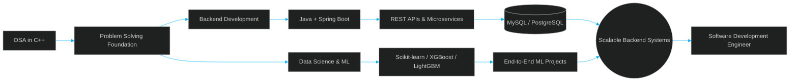

 

<!-- ============================================================ -->
<!--                       CURRENT FOCUS                           -->
<!-- ============================================================ -->

## 🎯 &nbsp;Current Focus

<table width="100%">
<tr>
<td width="25%" align="center">

### 🔨
**Building**
 
Backend services & REST APIs with Spring Boot

</td>
<td width="25%" align="center">

### 🌱
**Learning**
 
Advanced Java, Databases & System Design fundamentals

</td>
<td width="25%" align="center">

### 💻
**Practicing**
 
DSA in C++ — 140+ problems on LeetCode

</td>
<td width="25%" align="center">

### 🤝
**Open To**
 
Internships & backend engineering opportunities

</td>
</tr>
</table>

<!-- ============================================================ -->
<!--                        TECH STACK                             -->
<!-- ============================================================ -->

## 🛠️ &nbsp;Tech Stack

### Languages

  

### Backend Development

  

### Databases

  

### Data Science & Machine Learning

  

### Developer Tools

 

<b>📋 Full Skills Matrix (click to expand)</b>

 

| Category | Skills |
|---|---|
| **Languages** | Java · C++ · Python · SQL |
| **Backend** | Spring Boot · REST APIs · Hibernate / JPA · Maven · JWT · Microservices |
| **Databases** | MySQL · PostgreSQL |
| **Data Science** | Data Analysis · Data Visualization · Feature Engineering · Statistics |
| **Machine Learning** | Scikit-learn · XGBoost · LightGBM · Regression · Classification · Clustering · PCA |
| **Tools** | Git · GitHub · MySQL Workbench · IntelliJ IDEA · VS Code · Postman |
| **DSA** | Practiced in C++ — 140+ problems solved on LeetCode |

 

<!-- ============================================================ -->
<!--                    SKILLS ARCHITECTURE                        -->
<!-- ============================================================ -->

## 🧱 &nbsp;How My Skills Connect

 

<!-- ============================================================ -->
<!--                    FEATURED PROJECTS                          -->
<!-- ============================================================ -->

## 🚀 &nbsp;Featured Projects

<table>
<tr>
<td width="50%" valign="top">
<h3>🗂️ <a href="https://github.com/aryanmishra1182-byte/Student-Hub">Student Hub</a></h3>

A student productivity platform to manage timetables, notes, and tasks in one unified interface.

  

**Highlights:**
- Centralized dashboard for daily academic workflow
- Task and note management in a single view

</td>
<td width="50%" valign="top">
<h3>🎯 <a href="https://github.com/aryanmishra1182-byte/redrob-ai-candidate-ranking">AI Candidate Ranking</a></h3>

AI-powered candidate discovery and ranking system using semantic retrieval and hybrid scoring.

  

**Highlights:**
- Combines semantic retrieval with rule-based scoring
- Ranks candidates against role requirements

</td>
</tr>
<tr>
<td width="50%" valign="top">
<h3>📈 <a href="https://github.com/aryanmishra1182-byte/AryanMishra_PBEL_3.0">Student Performance Prediction</a></h3>

An end-to-end ML project predicting student exam performance from academic, lifestyle, and demographic features.

  

**Highlights:**
- Full pipeline from raw data to a deployed prediction model
- Feature engineering across academic and lifestyle variables

</td>
<td width="50%" valign="top">
<h3>🎙️ <a href="https://github.com/aryanmishra1182-byte/voice-ai-detector">Voice AI Detector</a></h3>

A machine learning system to detect AI-generated voice/audio, served through a web application.

  

**Highlights:**
- Trained model served through a lightweight web frontend
- Dedicated modules for model, security, and utilities

</td>
</tr>
<tr>
<td width="50%" valign="top">
<h3>🤖 <a href="https://github.com/aryanmishra1182-byte/autonomous-ai-persona">Autonomous AI Persona</a></h3>

A Java-based project exploring autonomous AI persona/agent behavior.

  

**Highlights:**
- Java-based exploration of agent-driven behavior patterns

</td>
<td width="50%" valign="top" align="center">

  

💡 **More backend & Spring Boot projects in progress.**

Check my full [repository list →](https://github.com/aryanmishra1182-byte?tab=repositories)

  

</td>
</tr>
</table>

<!-- ============================================================ -->
<!--                      CODING PROFILES                          -->
<!-- ============================================================ -->

## 🏆 &nbsp;Coding Profiles

 

| Platform | Handle | Link |
|:---:|:---:|:---:|
| 💻 GitHub | `aryanmishra1182-byte` | [Visit →](https://github.com/aryanmishra1182-byte) |
| 🟠 LeetCode | `Aryannn1` | [Visit →](https://leetcode.com/u/Aryannn1/) |
| 🍫 CodeChef | `crowd_grape_01` | [Visit →](https://www.codechef.com/users/crowd_grape_01) |
| 🟢 HackerRank | `aryanmishra1182` | [Visit →](https://www.hackerrank.com/aryanmishra1182) |

 

<!-- ============================================================ -->
<!--                    GITHUB STATISTICS                          -->
<!-- ============================================================ -->

## 📊 &nbsp;GitHub Statistics

 

  

> *All stat cards above are rendered live by third-party GitHub services and update automatically — no manual editing needed. If one fails to load momentarily, the rest of the page still renders correctly.*

<!-- ============================================================ -->
<!--                        PHILOSOPHY                             -->
<!-- ============================================================ -->

## 💭 &nbsp;Philosophy

> ### "The best way to learn software engineering is to build, break, debug, and build again."

 

<b>🧠 A Few Principles I Try to Code By</b>

 

- **Consistency beats intensity** — daily DSA practice compounds faster than occasional sprints.
- **Understand before you optimize** — clean, correct code first; performance tuning second.
- **Read the error, not just the stack trace** — most bugs explain themselves if you slow down.
- **Build things that are actually used** — a working small project beats an unfinished ambitious one.

 

<!-- ============================================================ -->
<!--                       CONNECT WITH ME                         -->
<!-- ============================================================ -->

## 📫 &nbsp;Connect With Me

  

**📧 aryanmishra1182@gmail.com**

 

<i>Thanks for stopping by — always open to feedback, collaboration, and new opportunities.</i>

<!-- ============================================================ -->
<!--                       END OF README                           -->
<!-- ============================================================ -->
