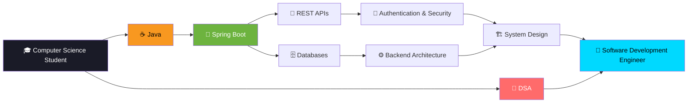
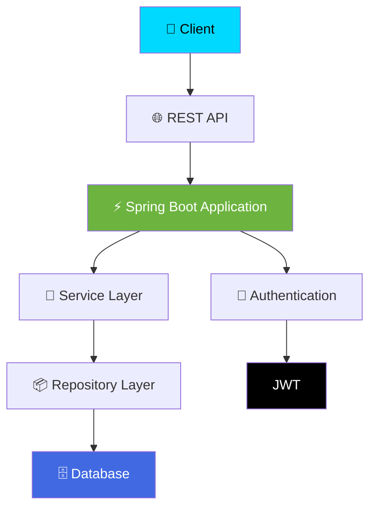
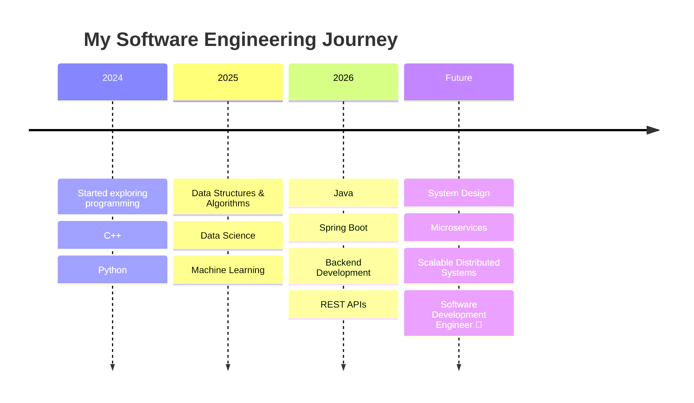

# <p align="center">⚡ Aryan Mishra ⚡</p>

<h3 align="center">
  
</h3>

<p align="center">


</p>

---

# 🌌 Welcome to My Digital Universe

<p align="center">

```text
┌─────────────────────────────────────────────────────────────┐
│                                                             │
│        👨‍💻 SOFTWARE ENGINEERING JOURNEY IN PROGRESS         │
│                                                             │
│   Java ☕ → Spring Boot 🌱 → Databases 🗄️ → System Design 🏗️ │
│                                                             │
│          Solve • Build • Debug • Learn • Repeat 🔥         │
│                                                             │
└─────────────────────────────────────────────────────────────┘
```

</p>

---

# 👋 About Me

```java
public class AryanMishra {

    String role = "Aspiring Software Development Engineer";

    String[] currentFocus = {
        "Java",
        "Spring Boot",
        "Backend Development",
        "Databases",
        "System Design",
        "Data Structures & Algorithms"
    };

    String currentlyBuilding =
        "Backend applications and scalable REST APIs";

    String goal =
        "Become a skilled Software Development Engineer 🚀";

}
```

### 🧠 Quick Facts

* 🎓 **B.Tech Computer Science & Engineering (Data Science)**
* 📚 Currently in my **5th Semester**
* ☕ Focused on becoming a strong **Java Backend Developer**
* 🧩 Practicing **Data Structures & Algorithms in C++**
* 🌱 Learning **Advanced Java, Spring Boot, Databases & System Design**
* 🏗️ Interested in **Scalable Backend Systems**
* 📊 Background in **Data Science & Machine Learning**
* 🤝 Open to **Internships, Collaborations & Learning Opportunities**

---

# 🎯 Current Mission

<p align="center">

| 🚀 Building          | 🌱 Learning   | 🧩 Practicing   | 🎯 Goal                  |
| -------------------- | ------------- | --------------- | ------------------------ |
| Spring Boot Projects | Advanced Java | DSA             | SDE Role                 |
| REST APIs            | Spring Boot   | Problem Solving | Strong Backend Engineer  |
| Backend Systems      | Databases     | LeetCode        | Scalable Systems         |
| Real-world Projects  | System Design | C++             | Internship Opportunities |

</p>

---

# 🗺️ My Developer Roadmap



---

# 🛠️ Tech Arsenal

## 💻 Programming Languages

<p>


</p>

<p>


</p>

---

## 🌱 Backend Development

<p>


</p>

<p>


</p>

---

## 🗄️ Databases

<p>


</p>

<p>


</p>

---

## 📊 Data Science & Machine Learning

<p>


</p>

---

## ⚙️ Developer Tools

<p>


</p>

---

# 🏗️ Backend Development Architecture



---

# 🚀 Featured Projects

<table>

<tr>

<td width="50%" valign="top">

<h3>🗂️ Student Hub</h3>

A student productivity platform designed to manage academic activities in one place.

### ✨ Features

* 📅 Manage Timetables
* 📝 Store Notes
* ✅ Track Tasks
* 🎯 Improve Productivity

<p>


</p>

<a href="https://github.com/aryanmishra1182-byte/Student-Hub">

</a>

</td>

<td width="50%" valign="top">

<h3>🎯 AI Candidate Ranking</h3>

AI-powered candidate discovery and ranking system using intelligent retrieval and scoring.

### ✨ Features

* 🔍 Candidate Discovery
* 🧠 Semantic Retrieval
* 📊 Hybrid Ranking
* ⚡ Intelligent Scoring

<p>


</p>

<a href="https://github.com/aryanmishra1182-byte/redrob-ai-candidate-ranking">

</a>

</td>

</tr>

<tr>

<td width="50%" valign="top">

<h3>📈 Student Performance Prediction</h3>

End-to-end machine learning application that predicts student exam performance.

### 🔥 Tech Stack

`Python` • `Pandas` • `NumPy`

`Scikit-learn` • `XGBoost` • `Flask`

<a href="https://github.com/aryanmishra1182-byte/AryanMishra_PBEL_3.0">

</a>

</td>

<td width="50%" valign="top">

<h3>🎙️ Voice AI Detector</h3>

Machine learning system designed to identify AI-generated and human voice/audio.

### ✨ Features

* 🎧 Audio Processing
* 🤖 AI Voice Detection
* 🧠 ML Model
* 🌐 Web Application

<a href="https://github.com/aryanmishra1182-byte/voice-ai-detector">

</a>

</td>

</tr>

<tr>

<td width="50%" valign="top">

<h3>🤖 Autonomous AI Persona</h3>

A Java-based project exploring autonomous AI agent and persona behavior.

<p>


</p>

<a href="https://github.com/aryanmishra1182-byte/autonomous-ai-persona">

</a>

</td>

<td width="50%" valign="top">

<h3>🚧 More Projects Coming Soon</h3>

Currently working on exciting projects involving:

```text
☕ Java
🌱 Spring Boot
🗄️ Databases
🔐 Authentication
🏗️ Backend Architecture
```

</td>

</tr>

</table>

---

# 🧩 Problem Solving Journey

<p align="center">

<a href="https://leetcode.com/u/Aryannn1/">


</a>

</p>

```text
┌──────────────────────────────────────┐
│                                      │
│        🧩 DSA JOURNEY                │
│                                      │
│   Arrays          ██████████         │
│   Strings         █████████          │
│   Linked Lists    ███████            │
│   Recursion       ████████           │
│   Trees           ██████             │
│   Graphs          █████              │
│   Dynamic Prog.   ████               │
│                                      │
│      Learning Never Stops 🚀         │
│                                      │
└──────────────────────────────────────┘
```

---

# 🧠 Learning Timeline



---

# 📊 GitHub Analytics

<p align="center">


</p>

<p align="center">


</p>

---

# 🐍 Contribution Snake

<p align="center">


</p>

> ⚠️ **Note:** The contribution snake requires a GitHub Actions workflow to generate automatically.

---

# 🏆 Developer Mindset

<p align="center">

```text
             💡 IDEA
               │
               ▼
          🧠 THINK
               │
               ▼
          💻 BUILD
               │
               ▼
          🐛 DEBUG
               │
               ▼
          🚀 DEPLOY
               │
               ▼
          📈 IMPROVE
               │
               └───────────────► REPEAT 🔥
```

</p>

---

# 🎯 Current Goals

* [x] Build a strong programming foundation
* [x] Learn Data Structures & Algorithms
* [x] Start Java Development
* [x] Learn Spring Boot Fundamentals
* [ ] Build multiple production-style backend projects
* [ ] Master SQL & Database Design
* [ ] Learn Authentication & Security
* [ ] Understand System Design Fundamentals
* [ ] Contribute to Open Source
* [ ] Secure a Software Development Internship 🚀

---

# 💭 Developer Philosophy

<p align="center">

> ### *"The best way to learn software engineering is to build, break, debug, and build again."*

</p>

---

# 🤝 Let's Connect

<p align="center">

<a href="https://github.com/aryanmishra1182-byte">


</a>

<a href="https://leetcode.com/u/Aryannn1/">


</a>

<a href="https://www.codechef.com/users/crowd_grape_01">


</a>

<a href="https://www.hackerrank.com/aryanmishra1182">


</a>

</p>

---

<p align="center">

### ⭐ *Thanks for visiting my profile!*


</p>

<p align="center">


</p>
